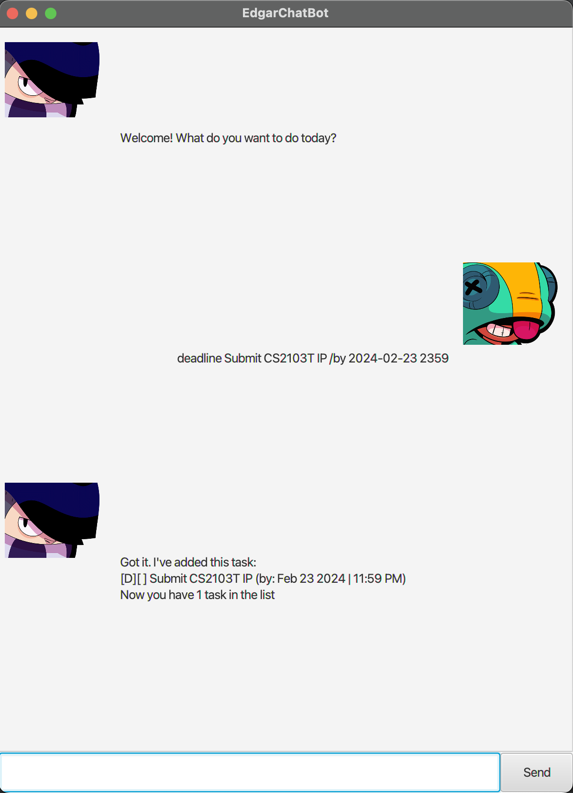

# Edgar User Guide

👋 Welcome to EdgarChatBot



## Product Introduction
Edgar is a software application designed to aid you with the management of your daily tasks!

## Features
Note: There are three types of tasks: Todo, Deadline and Event.

### 1. Adding a todo: `todo`

Example: `todo taskDescription`

- **Expected Output**:

```
	 Got it. I've added this task:
	 [T][ ] taskDescription
	 Now you have 1 task in the list
```

### 2. Adding a deadline: `deadline`

Example: `deadline taskDescription /by 2024-02-23 2359`

The 24-hour time is optional, if you leave it empty, the chatbot will automatically set it as 12:00AM

- **Expected Output**:

```
	 Got it. I've added this task:
	 [D][ ] taskDescription (by: 23 Feb 2024 | 11:59 PM)
	 Now you have 2 tasks in the list
```
### 3. Adding an event: `event`

Example: `event taskDescription /from 2024-02-23 2300 /to 2024-02-23 2359`

 The 24-hour time is optional, if you leave it empty, the chatbot will automatically set it as 12:00AM

- **Expected Output**:

```
	 Got it. I've added this task:
	 [E][ ] taskDescription (from: 23 Feb 2024 | 11:00 PM to: 23 Feb 2024 | 11:59 PM)
	 Now you have 3 tasks in the list
```
### 4. Listing all tasks: `list`
Example: `list`
- **Expected Output**:

```
	 Here are the tasks in your list:
	 1.[T][ ] taskDescription
	 2.[D][ ] taskDescription (by: 23 Feb 2024 | 11:59 PM)
	 3.[E][ ] taskDescription (from: 23 Feb 2024 | 11:00 PM to: 23 Feb 2024 | 11:59 PM)
```
### 5. Marking task as done: `mark`
Example: `mark 1`
- **Expected Output**:

```
	 Nice! I've marked this task as done:
	 [T][X] taskDescription
```

### 6. Marking task as not done: `unmark`
Example: `unmark 1`
- **Expected Output**:

```
	 OK, I've marked this task as not done yet:
	 [T][] taskDescription
```

### 7. Deleting a task: `delete`
Example: `delete 1`
- **Expected Output**:

```
	 Noted. I've remvoved this task:
	 [T][] taskDescription
	 now you have 2 tasks in the list
```

### 8. Finding tasks: `find`
Example: `find taskDescription`
- **Expected Output**:

```
	 Here are the matching tasks in your list:
	 1.[D][ ] taskDescription (by: 23 Feb 2024 | 11:59 PM)
	 2.[E][ ] taskDescription (from: 23 Feb 2024 | 11:00 PM to: 23 Feb 2024 | 11:59 PM)
```

### 9. Exiting the program: `bye`
Example: `bye`

The application will automatically exit after 2 seconds.

### 10. Saving the data

Task data are saved locally after any data is modified. There is no need to save manually.
